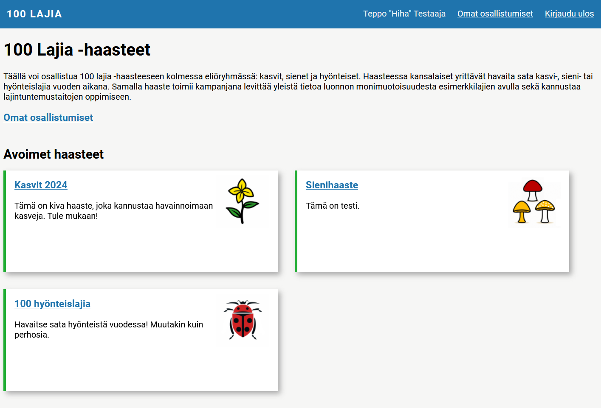

# 100 Species Challenge Web Service

A web app designed for organizing and participating in wildlife observation challenges, specifically targeting the identification of 100 species. In these challenges, participants aim to observe a hundred different species of plants, fungi, or insects over the course of a year.

Backend application built with Flask. Database on MariaDB. Depends on FinBIF Laji-auth authentication service (Laji.fi). Funded by [Kone Foundation, 2023](https://koneensaatio.fi/en/grants-and-residencies/sata-lajia-haaste-2/).

## Development setup

- Clone this repository
- Optionally change development database password to `docker-entrypoint-initdb.d/init_db.sql`
- Set up environment variables to `.env.` and `playwright.example` Use example files as templates.
- Build Docker image `docker build -t species-challenge:latest .`
- Startup with `docker-compose up build playwright; docker-compose down;`
- Set up database using `species_challenge_dev.sql`, e.g. via phpMyAdmin

Site will be visible http://localhost:8081

phpMyAdmin admin UI will be at http://localhost:8080 

## Running tests

- Run the app with `docker-compose up; docker-compose down;`
- Login to playwright container with `docker exec -ti species-challenge-playwright-1 bash`
- Run tests with `python -m pytest -v`. Add `-s` option to the end to see print outputs.

## Notes

- The UI prevents setting dates that are outside the challenge dates, and dates in the future. This relies on min & max attributes on the date field and browser validation and error messages.
    - If a challenge for 2025 is published in 2024, users have to clear dates which they might have added by clicking the species name. Better solution wpould be to edit the Javascript so that it wont add today's date if it's outside the allowed range.

#### Future: To have a new challenge type, you would need to:

- Define new types to data/challenge_vocabulary.json
- When loading participation edit form, load the challenge data to see the type
    - Router calls a helper, passes this data also to method
- On router, select template based on the type
    - Template includes additional fields (no rendering same field differently, that would create complexity)
- On method, select type-specific validator (using a function that passes the validator) to validate participation data
- This way form template and validator make sure the data is always ok.
- SQL inset & update queries need to be duplicated or automated.
- So data structure need to be defined in four places
    - Database: new fields
    - Form: new fields and UI
    - Validator: field values
    - Database query: fields and values

## Todo

### Next

- Check http://localhost:8081/osallistuminen/4/6
    - it has e.g. ahvenvita, whic is not part of species list MX.67601
        - why does it save it? this is how it should be; save taxa that are not on the basic list
        - why does it show it on the list? should show at the end
        - should we version the species lists? work with 
        - how to show names of additional species? fetch from participation table, api or json?

### Setup

- Clarify Docker build commands
- Database sorting/collation settings utf8mb4_swedish_ci
- Generic exception handling
- Set target to 100 species on challenge.py & admin.py
- Deployment to staging & production
    - Reduce logging
    - Don't follow files with Gunicorn
    - Login dev/prod parametrized through /login & env?
    - Databases
        - Automate database setup - does OpenShift need this?
    - Login with system id's
    - Zabbix
- Clear unneeded & trashed items from database, store dump to Git 

### Features

- Test:
    - Automated testing with Playwright
        - Admin editing challenges
        - Logout
    - Giving malicious login token
    - Giving incorrect numeric challenge & participation id's -> redirect with flash
    - Thorough testing by multiple people
- First production version:
    - Mobile navi & testing, including autocomplete
    - All 3 lists
    - Adjust autocomplete additional species API call: only finnish, only species, colloquial names, match type?
        - Filter out taxa that are not on the local species list, or make the system work with also taxa that are not on the list.
    - Autocomplete informal groups from database
    - Styling
- Later:
    - Remove button (dull red X?) to participation form taxon list
    - Move observed species list away from challenge main page to separate page, preparing for tables that have >200 observers and species 
    - Prevent editing species of closed / draft challenge participations
    - Spinner to autocomplete
    - Handling higher taxa (is uses adds rikkavoikukka, don't add voikukat to taxon_count)
    - Accessibility
    - Own data dump download
    - Admin ability to edit any participations
    - Challenge sort order (int) for the front page
    - My participation species accumulation chart
    - Activity stats, e.g. users active during last 7 days, new participations
    - Exclude existing species from the autocomplete? Could exclude all top N species, what to do then?
- Nice:
    - Admin to see user email
    - Min and max dates instead of year to database
        - Database structure change, content change and sql dump update
        - Challenge form update, with date fields
        - Challenge year validation replacement with min & max validation
        - Test
        - Use these when creating date fields on participation form
            - Existing fields / Python
            - Empty fields / Python
            - Additional species fields / js
