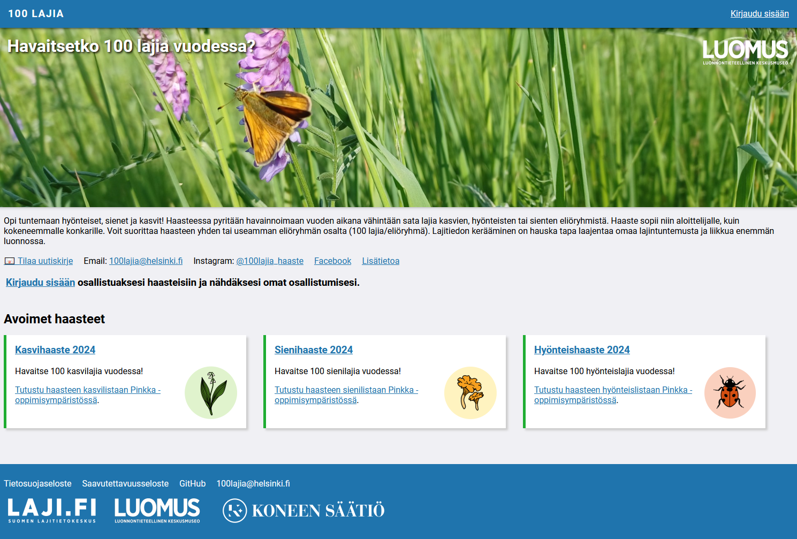

# 100 Species Challenge Web Service

A web app designed for organizing and participating in wildlife observation challenges, specifically targeting the identification of 100 species. In these challenges, participants aim to observe a hundred different species of plants, fungi, or insects over the course of a year.

Backend application built with Flask. Database on MariaDB. Depends on FinBIF Laji-auth authentication service (Laji.fi). Funded by [Kone Foundation, 2023](https://koneensaatio.fi/en/grants-and-residencies/sata-lajia-haaste-2/).

## Development setup

- Clone this repository `git clone ...`
- Switch to dev branch `git checkout dev`
- Optionally change development database password to `docker-entrypoint-initdb.d/init_db.sql`
- Set up environment variables to `.env.` and `playwright.example` Use example files as templates.
- Build Docker image `docker build -t species-challenge:latest .`
- Startup with one of these commands:
    - With Playwright: `docker-compose up build playwright; docker-compose down;`
    - Without Playwright: `docker-compose up; docker-compose down;`
- Set up database:
    - phpMyAdmin is available at http://localhost:8080
    - Import file from ´./sql/species_challenge_dev.sql´

Site will be visible http://localhost:8081

phpMyAdmin admin UI will be at http://localhost:8080 

## Running tests

- Run the app with `docker-compose up; docker-compose down;`
- Login to playwright container with `docker exec -ti species-challenge-playwright-1 bash`
- Run tests with `python -m pytest -v`. Add `-s` option to the end to see print outputs.

## OpenShift setup

Note that in order to create MariaDB database on Rahti, PHPMyAdmin data dump does not work. You need to create the dump on the command line:

    mariadb-dump --user=USERNAME --password --lock-tables --databases DATABASENAME > ./species-challenge.sql

## Notes

- Setting up new challenge
    - Provide list of basic taxa to `app/data/`, e.g. `plantae_2024.json` or use one of the existing ones.
    - Provide list of all allowed taxa to `app/data/` (for backend) and `static/taxa/` (for frontend autocomplete), e.g. `plantae_2024_all.json`. This must contain all taxa that the basic list above contains, icnluding non-species.
- Challenge has field for autocomplete-parameters, but these are not currently used. Instead autocomplete uses static file as described above. This is to 
    - Make it faster than API calls (nearly instantaneous)
    - Allow more flexibility, e.g. having only few higher taxa in addition to species
- The UI prevents setting dates that are outside the challenge dates, and dates in the future. This relies on min & max attributes on the date field and browser validation and error messages, and has limitations based on browser.
    - If a challenge for 2025 is published in 2024, users have to clear dates which they might have added by clicking the species name (i.e. dates that are in 2024). Better solution would be to edit the Javascript so that it wont add today's date if it's outside the allowed range.
- When challenge is in draft or closed state, we need to allow editing participation data excluding species, because deleting or anonymizing depends on that.

#### Future: To have a new challenge type, you would need to:

- Define new types to data/challenge_vocabulary.json
- When loading participation edit form, load the challenge data to see the type
    - Router calls a helper, passes this data also to method
- On router, select template based on the type
    - Template includes additional fields (no rendering same field differently, that would create complexity)
- On method, select type-specific validator (using a function that passes the validator) to validate participation data
- This way form template and validator make sure the data is always ok.
- SQL inset & update queries need to be duplicated or automated.
- So data structure need to be defined in four places
    - Database: new fields
    - Form: new fields and UI
    - Validator: field values
    - Database query: fields and values

## Todo

### Changes for v 2.0

- Update code to staging
- Add new fields to database:
  ALTER TABLE `challenges` ADD `date_begin` VARCHAR(10) NULL AFTER `year`, ADD `date_end` VARCHAR(10) NULL AFTER `date_begin`;
- Remove old fields from database:
  ALTER TABLE `challenges` DROP `year`;
- Add begin and end date to all challenges

### Next

* If user removes name and then trashes the participation, saving fails, and some data disappears.
    * Should removal be completely different procedure, that only UPDATES trashed = 1, and does not UPDATE anything else?
* Trim whitespace from MX codes, both on read and write
* On Safari, scroll date errors in view: https://chat.openai.com/share/cf043643-8b07-4394-b10e-30a383d54479
* On safari, autocomplete shows list bullets

### Setup

- Version numbering?
- More robust error handling and restart? Try with triggering syntax error.
- Clarify Docker build commands
- Database sorting/collation settings utf8mb4_swedish_ci?
- Backup monitoring

### Features todo

- Test:
    - Automated testing with Playwright
        - Admin editing challenges
        - Logout
    - Giving malicious login token
    - Giving incorrect numeric challenge & participation id's -> redirect with flash
- For 2025:
    - Handling higher taxa (is uses adds rikkavoikukka, don't add voikukat to taxon_count)
    - Prevent editing species of closed / draft challenge participations
    - Accessibility
    - Maybe: Move observed species list away from challenge main page to separate page, preparing for tables that have >200 observers and species 
    - Challenge sort order (int) for the front page - larger number shown on top
- School challenge:
    - Start date and end date instead of year (replace settings on challenge, modify form & validations)
    - No additional taxa (setting to challenge, modify form)
- Later:
    - Move login_url, api_url, target id yms. konfiguraatiotiedostoon
    - Own data dump download
    - Admin ability to edit any participations
    - My participation species accumulation chart
    - Activity stats, e.g. users active during last 7 days, new participations
- Nice:
    - Min and max dates instead of year to database
        - Database structure change, content change and sql dump update
        - Challenge form update, with date fields
        - Challenge year validation replacement with min & max validation
        - Test
        - Use these when creating date fields on participation form
            - Existing fields / Python
            - Empty fields / Python
            - Additional species fields / js
